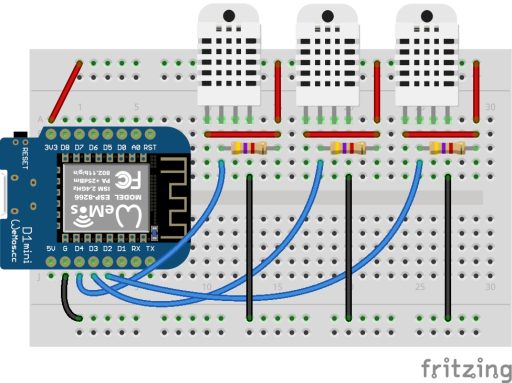

Arduino code to be installed on an ESP8266
to read temperature and humidity data from a number of
DHT22s and publish to an MQTT server.

### Prereqs

Need to install some things using the Arduino IDE:

Board (install in Arduino Boards Manager):
- esp8266 by ESP8266 Community version 2.3.0

Arduino libraries:
- Adafruit Unified Sensor by Adafruit version 1.0.2 (needed by their DHT sensor library)
- DHT sensor library by Adafruit version 1.3.0
- PubSubClient by Nick O'Leary version 2.6.0 (MQTT client)

### Wiring

DHT22s are pretty simple to wire.
One pin goes to ground,
one pin goes to Vcc (anything from 3.3V to 6V),
and the last pin goes to your digital output pin and a pull-up resistor.
There's a 4th pin ('null') that does nothing.
Some DHT22 packages with only 3 pins that include the pull-up resistor.

### Changelog

- 2019-03-14 - Configuration can be done via serial port
